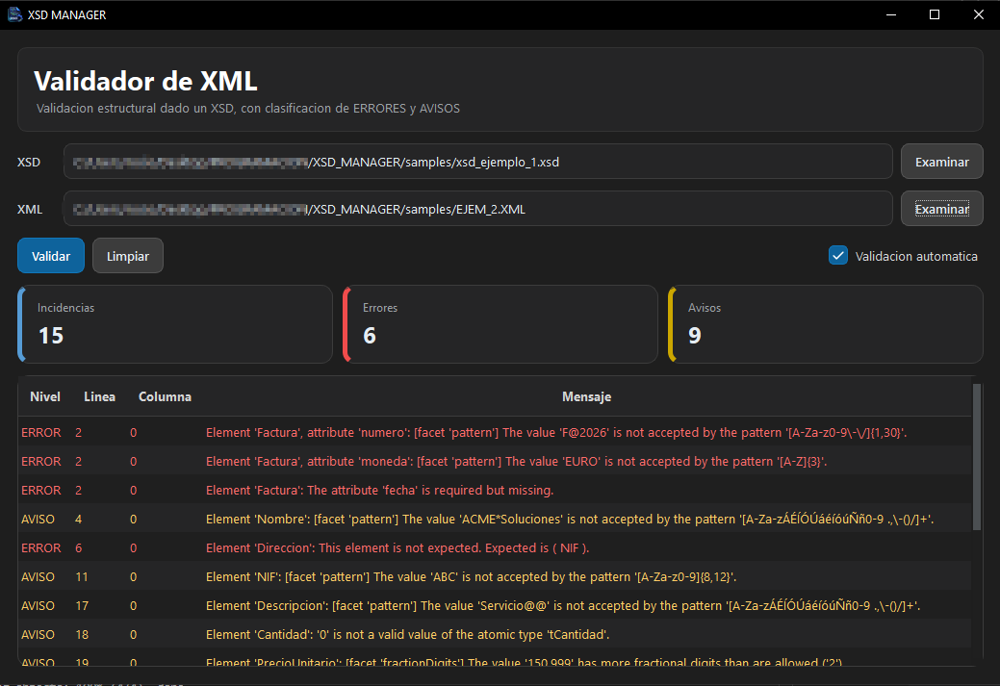

# XSD Manager
<p align="center">
  
</p>

**Desktop tool for XML/XSD validation and future schema management.**  
Built in Python.

## Features (v0.1)
- Validate XML files against XSD schemas
- Clear error reporting (line/column when possible)
- Simple GUI workflow



## Roadmap
- XSD/XML manager (browse, edit, organize)
- Recent projects / favorites
- Export validation reports

## How to run
```bash
pip install -r requirements.txt
python main.py
```

