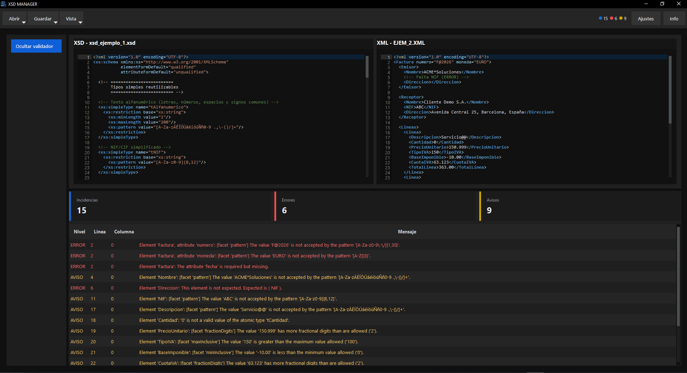

# XSD Manager
<p align="center">
  
</p>

**Desktop tool for XML/XSD validation and future schema management.**  
Built in Python.

## Features (v0.2)
- Validate XML files against XSD schemas
- Clear error reporting (line/column when possible)
- New UI with files management



## Features
- **XSD/XML Manager** – Browse, edit, and organize XSD and XML files.
- **Easy XSD Builder** – Quickly create and structure XSD schemas.
- **XSD Standardization** – Tools to standardize and maintain consistent XSD structures.
- **Automatic XML Test Generator** – Generate test XML files based on XSD rules.
- **Schematron Support** – Validate XML documents using Schematron rules.
- **Validation Report Export** – Export detailed validation reports.

## How to run
```bash
pip install -r requirements.txt
python main.py
```

